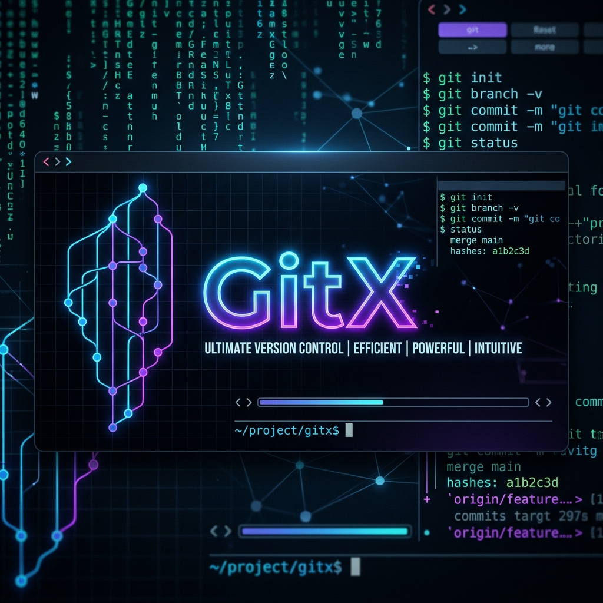

<p align="center">
  
</p>

<h1 align="center">GitX</h1>

<p align="center">
  <b>The Ultimate Git Power Toolkit</b>
</p>

<p align="center">
  <i>A single CLI that replaces dozens of git aliases, scripts, and third-party tools<br>with one unified, beautiful command-line experience.</i>
</p>

<div align="center">

  
  
  
  
  

</div>

<br>

## The Problem

Git is the backbone of modern development, but its CLI was designed for plumbing, not for humans. Everyday tasks like understanding code ownership, reviewing changes, or generating changelogs require juggling a dozen separate tools, aliases, and scripts.

<table width="100%">
  <tr>
    <td width="33%" valign="top">
      <h3 align="center">&#128679; Tool Sprawl</h3>
      <p align="center">You need <code>git-extras</code> for stats, <code>gitleaks</code> for secrets, <code>cocogitto</code> for changelogs, and more. Each with its own install, config, and quirks.</p>
    </td>
    <td width="33%" valign="top">
      <h3 align="center">&#128065; Zero Visibility</h3>
      <p align="center">Who owns this file? Where are the hotspots? What's the bus factor? Git has the data, but extracting it requires arcane <code>git log</code> incantations.</p>
    </td>
    <td width="33%" valign="top">
      <h3 align="center">&#9889; Context Switching</h3>
      <p align="center">Switching between terminal, browser, and dashboards to get a clear picture of your repository's health kills developer flow.</p>
    </td>
  </tr>
</table>

<br>

## The Solution

**GitX** is a single, zero-dependency binary that brings **30+ commands** directly to your terminal. It combines AI-powered intelligence, interactive TUI views, security scanning, and deep repository analytics into one cohesive toolkit.

<br>

---

## Command Reference

GitX organizes its commands into **7 categories**. Every command is designed to be fast, beautiful, and immediately useful.

---

### AI & Intelligence

Leverage Gemini AI and heuristic analysis to automate the tedious parts of your workflow.

| Command | Description |
| :--- | :--- |
| `gitx gen-msg` | Suggest a commit message from staged changes |
| `gitx gen-msg --ai` | Use **Gemini AI** to generate a smart commit message |
| `gitx chat` | Interactive TUI to ask questions about your repository |
| `gitx pr-summary` | Auto-generate a markdown Pull Request summary for the current branch |
| `gitx review` | Perform a heuristic pre-commit code review with severity ratings |
| `gitx refactor [file]` | Analyze code for refactoring opportunities (complexity, long functions, etc.) |

<br>

### Repository Insights

Get a deep understanding of your project's history and health at a glance.

| Command | Description |
| :--- | :--- |
| `gitx stats` | Display comprehensive repository statistics |
| `gitx loc` | Count lines of code across the project |
| `gitx contributors` | List all contributors and their impact |
| `gitx timeline` | Visualize commit activity over time |
| `gitx changelog` | Auto-generate a changelog from conventional commits (Features, Fixes, Other) |

<br>

### Code Analysis

Find the code that matters most. Understand ownership, risk, and churn.

| Command | Description |
| :--- | :--- |
| `gitx who <file>` | Show who owns each section of a file (enhanced blame with percentages) |
| `gitx hotspots` | Interactive TUI combining churn + complexity to find risky code areas |
| `gitx search <query>` | Full-text search across your entire commit history |

<br>

### Visualization

See your repository's heartbeat through beautiful terminal-native views.

| Command | Description |
| :--- | :--- |
| `gitx weather` | A metaphorical weather report for your repo's health |
| `gitx pulse` | Interactive TUI showing the repository's activity pulse |
| `gitx log` | Enhanced, styled git log viewer |

<br>

### Productivity

Streamline your daily workflow with smart shortcuts.

| Command | Description |
| :--- | :--- |
| `gitx wip` | Instantly save all work-in-progress as a timestamped WIP commit |
| `gitx standup` | Show all your commits from the last 24 hours across repos |
| `gitx ignore` | Manage `.gitignore` entries |
| `gitx leaderboard` | Fun contributor leaderboards (The Historian, The Cleaner, The Nomad) |

<br>

### Power Tools

Advanced utilities for performance, recovery, and diagnostics.

| Command | Description |
| :--- | :--- |
| `gitx speed` | Profile and audit git performance with optimization suggestions |
| `gitx rescue` | Find and recover "ghost" commits floating in the object database |
| `gitx undo` | Interactive TUI to browse reflog and undo recent git operations |
| `gitx snapshot create <name>` | Create a lightweight named snapshot (better than stash) |
| `gitx snapshot list` | List all saved snapshots |

<br>

### Maintenance & Security

Keep your repository clean, healthy, and secure.

| Command | Description |
| :--- | :--- |
| `gitx doctor` | Run system diagnostics (git install, user config, remote config) |
| `gitx secrets scan` | Scan commit history and working tree for leaked API keys and passwords |
| `gitx clean` | Identify and clean up stale branches and artifacts |

<br>

---

## Tech Stack

Built for speed and zero-friction installation using the modern Go ecosystem.

| **Component** | **Technology** | **Purpose** |
| :--- | :--- | :--- |
| **CLI Framework** |  | Industry-standard command architecture with subcommands, flags, and auto-help |
| **TUI Engine** |  | Elm-inspired functional framework for rich interactive terminal UIs |
| **Terminal Styling** |  | CSS-like declarative styling for terminal output |
| **Git Backend** |  | Pure Go implementation of Git for deep, native integration |
| **AI Engine** |  | Google's Gemini for intelligent commit messages and code analysis |

<br>

---

## Installation

### Pre-built Binary
Download the latest `gitx.exe` from the [Releases](https://github.com/Sword-Saint69/Gitx/releases) page and add it to your `PATH`.

### Build from Source
```bash
git clone https://github.com/Sword-Saint69/Gitx.git
cd Gitx
go build -o gitx .
```

### Verify Installation
```bash
gitx doctor
```

<br>

---

## Quick Start

```bash
# See what you did today
gitx standup

# Check your repo's health
gitx weather

# Find risky code areas
gitx hotspots

# Generate a smart commit message with AI
gitx gen-msg --ai

# Scan for leaked secrets
gitx secrets scan

# Save work-in-progress instantly
gitx wip

# Recover a lost commit
gitx rescue

# Undo your last git mistake
gitx undo
```

<br>

---

## Architecture

```
gitx/
|-- main.go                  # Entry point
|-- cmd/                     # All 30+ CLI commands (Cobra)
|   |-- root.go              # Root command definition
|   |-- standup.go            # Standup report command
|   |-- chat.go              # AI chat TUI
|   |-- secrets.go           # Security scanning
|   |-- ...                  # And many more
|-- internal/
|   |-- git/                 # Core git logic layer
|   |   |-- ai.go            # Gemini AI integration
|   |   |-- analysis.go      # Churn, bus-factor analysis
|   |   |-- hotspots.go      # Hotspot detection engine
|   |   |-- ownership.go     # File ownership analysis
|   |   |-- rescue.go        # Lost commit recovery
|   |   |-- weather.go       # Health metaphor engine
|   |   |-- ...
|   |-- scanner/             # Security scanning engine
|   |-- ui/                  # All BubbleTea TUI views
|       |-- chat_view.go     # Interactive chat interface
|       |-- hotspots_view.go  # Hotspot visualization
|       |-- search_view.go   # Search results TUI
|       |-- ...
```

<br>

---

## Roadmap

- [x] **30+ Commands** across 7 categories
- [x] **Interactive TUIs** for hotspots, search, chat, undo, and more
- [x] **AI Integration** with Gemini for commit messages and code analysis
- [x] **Security Scanner** for detecting leaked secrets
- [x] **Performance Profiler** with optimization suggestions
- [x] **Ghost Commit Recovery** from the object database
- [ ] **Plugin System** for community-contributed commands
- [ ] **Custom Themes** for personalized terminal aesthetics
- [ ] **Multi-repo Dashboard** for managing multiple projects simultaneously
- [ ] **Git Hooks Manager** with pre-built hook templates
- [ ] **Deep AI Review** using LLM-based code analysis

<br>

---

## Contributing

Contributions are welcome! Please feel free to submit a Pull Request.

1. Fork the repository
2. Create your feature branch (`git checkout -b feature/amazing-feature`)
3. Commit your changes (`git commit -m 'feat: add amazing feature'`)
4. Push to the branch (`git push origin feature/amazing-feature`)
5. Open a Pull Request

<br>

---

## License

This project is licensed under the MIT License - see the [LICENSE](LICENSE) file for details.

<br>

<p align="center">
  <sub>Built with &#10084;&#65039; by <a href="https://github.com/Sword-Saint69">Sword-Saint69</a></sub>
  <br>
  <sub><i>One CLI to rule them all.</i></sub>
</p>